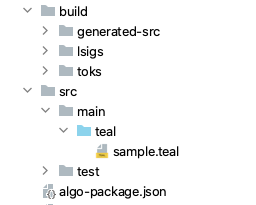

# Algorand Project Structure

The Algorand project's standard directory layout :

| Directory / File | Description |
| :--- | :--- |
| **src/main/teal** | TEAL program files |
| **algo-package.json** | Algorand package json files. Every algorand project should have this file at top level. |
| **build** | Build folder. The compiled binary and other files generated from source are stored here. |
| **build/toks** | Compiled TEAL file |
| **build/lsigs** | Logic Sig files generated from TEAL program |
| **build/generated-src** | Any generated source files from original TEAL programs are stored here. Example: If a TEAL program uses variables \(VAR\_TMPL\_\*\) inside the source code, the plugin generates the final source files with variable values under this folder. |

