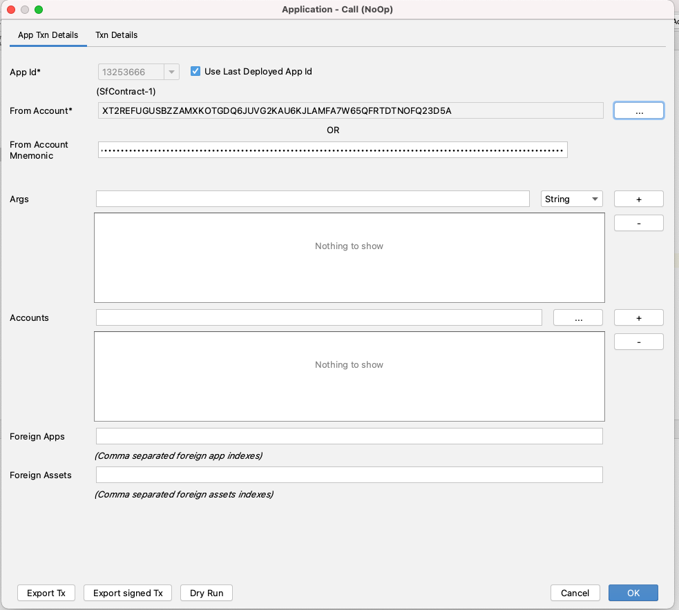
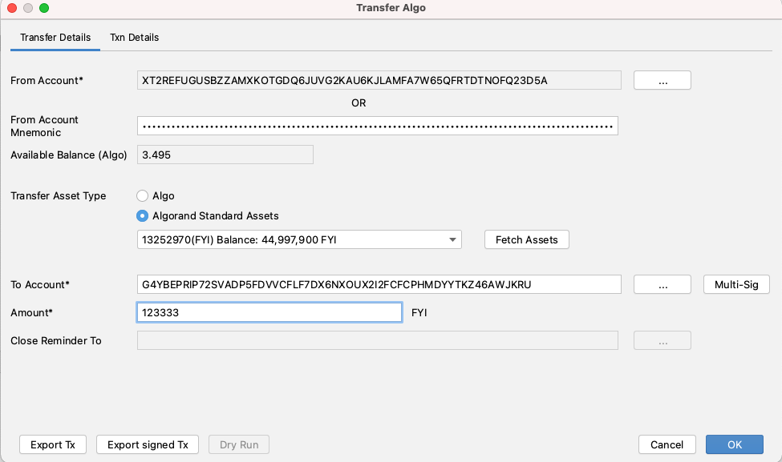
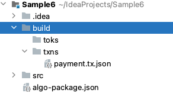
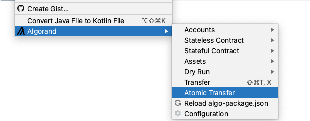
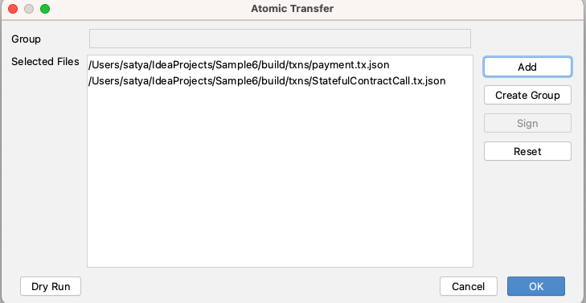
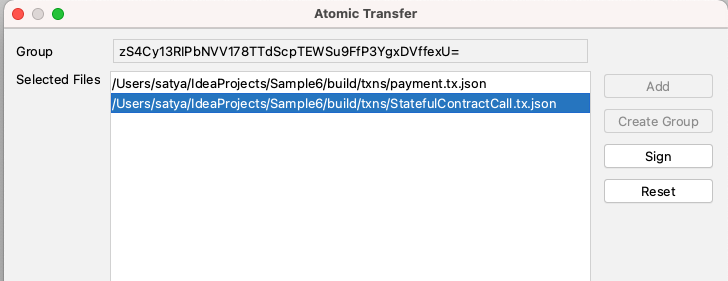
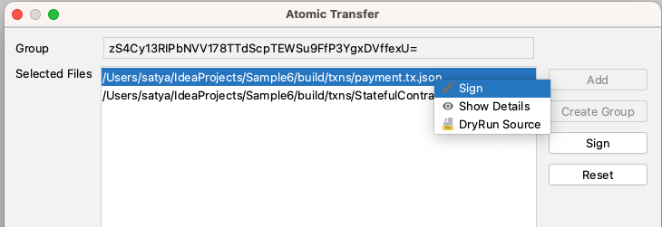
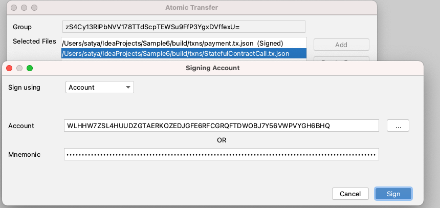
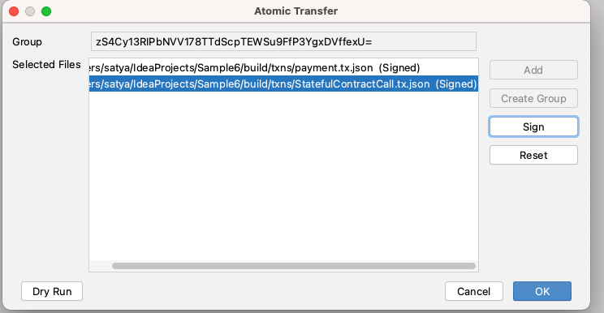

# Create Atomic Transfer

You can create  an **Atomic Transfer** transaction directly inside IntelliJ IDE. Multiple transactions can be grouped inside a single Atomic Transfer transaction, so that either all succeed or all fail.

To create an Atomic Transfer, you need to first export each individual transaction as json file. Once all required transactions are exported to their corresponding json files, you can group them and create an Atomic Transfer transaction in the "Atomic Transfer" option in the IDE.

The following sections describe how to export transactions,  create & post Atomic Transfer transactions.

1. **Export Transaction**

You can export any type of transaction \( Payment, Stateless contract, Stateful contract\) to a json file through **"Export Tx"** button in the transaction screen. When export button is click, transaction is not posted to the network.

  
Transaction json files are generated under the build/txns folder.

#### 2. Choose Atomic Transfer

To create an Atomic Transfer transaction, select Algorand &gt; Atomic Transfer

#### 3. Select Individual Transactions

Select and add individual transactions.

#### 4. Create Group

After adding all individual transactions, click on **"Create Group"** to create and assign group id to each transaction in the group. Once the group id is assigned, "Create Group" button will be disabled.

#### 5. Sign each transaction separately

Right click on each transaction and select "Sign" option to sign that transaction.

#### 6. Post Atomic Transfer transaction

Once all the transactions are signed, you are ready to post the atomic transfer transaction. Click Ok to post the atomic transfer transaction.

Now either all transaction succeed or all fail.

