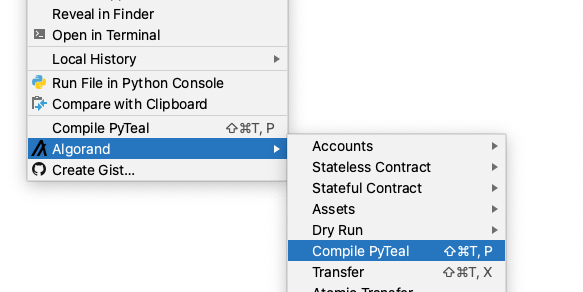
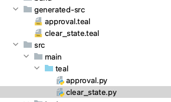
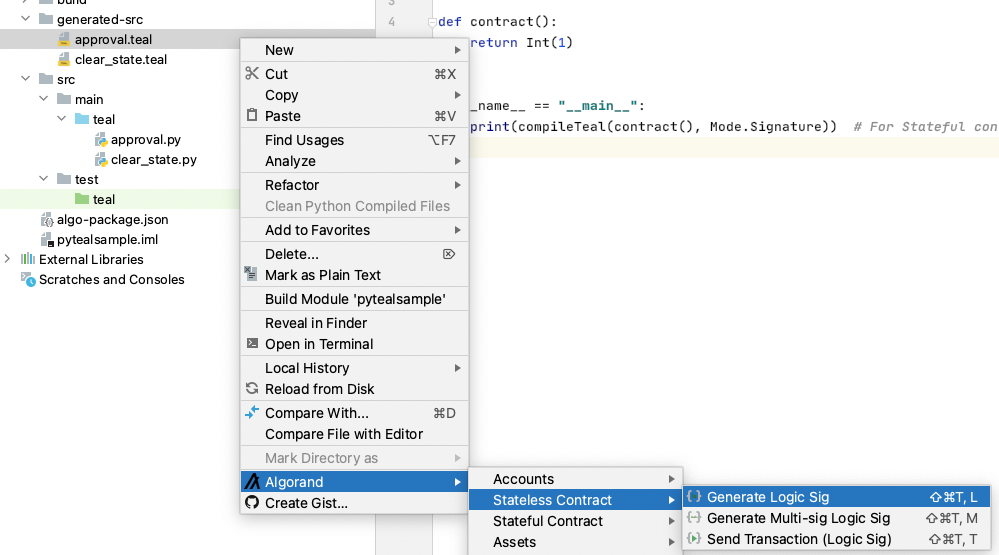

# Compile PyTeal File

You can not directly deploy a PyTeal file to create a stateful app or stateless logic sig file. The PyTeal file first needs to be compiled into a regular TEAL file and then the generated TEAL file can be used as part of stateful app or logic sig.

* To compile a PyTeal file, right click on the pyTeal file and select "Compile PyTeal".

* After PyTeal compilation, the final TEAL file is generated under **generated-src** folder. 

* Now you can use this generated TEAL file as a regular TEAL file. 

 For example:  Create a Logic Sig from this generated TEAL file or create a stateful app.

