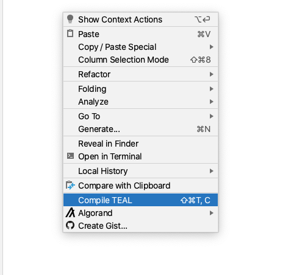

# Compile TEAL Program

A TEAL program can be compiled using goal command line tool or an Algorand node.

_TEAL compilation using a Local SDK \("goal" command line tool\) is currently supported on MacOS and Linux. For Windows, you can use a running Algorand Node for compilation._

1. Configure compiler.  Right click on the project / editor &gt; Algorand &gt; Configuration

You can configure a Local SDK \(goal\) or an Algorand node for the compilation. To do so, go to the configuration settings UI and update compiler setting.

2.  To compile, right click &gt; Compile TEAL

3. Alternatively, you can also configure compiler setting in the **"AlgorandExplorer"** toolwindow tab.

### Video - How to compile a TEAL program



