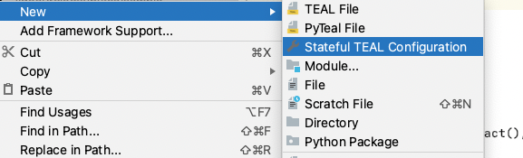
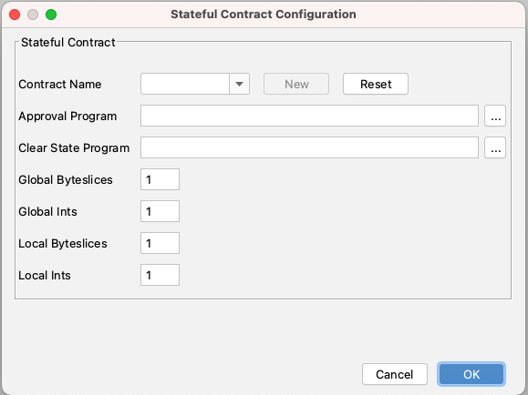
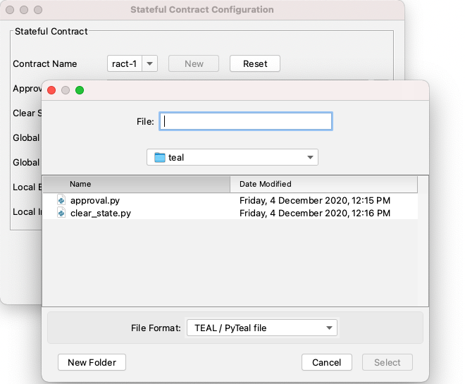
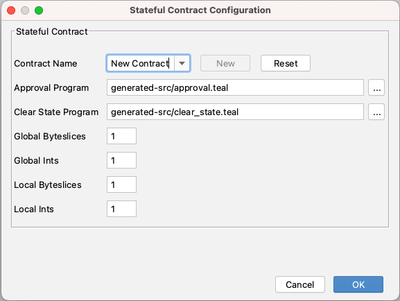

# Create or Configure a Stateful Contract with PyTeal Programs

You can create a new stateful contract configuration and set a PyTeal program as approval or clear state program for the stateful application.

To create a new stateful contract configuration,

* Right click on the project &gt; New &gt; Stateful TEAL Configuration

* Provide contract name, approval program and clear state program

* Select PyTeal program for both approval and clearstate program

* Notice that when you select a .py file for approval / clear state program, the value will be converted to \*.teal file in the generated-src folder. That's because the pyteal file is compiled into TEAL file during pyteal compilation.

