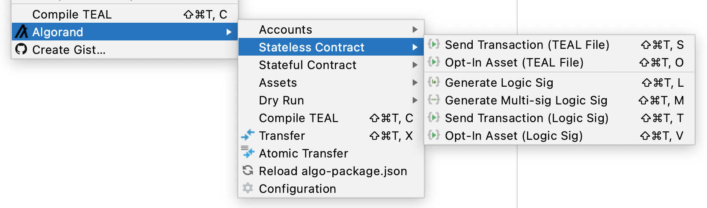
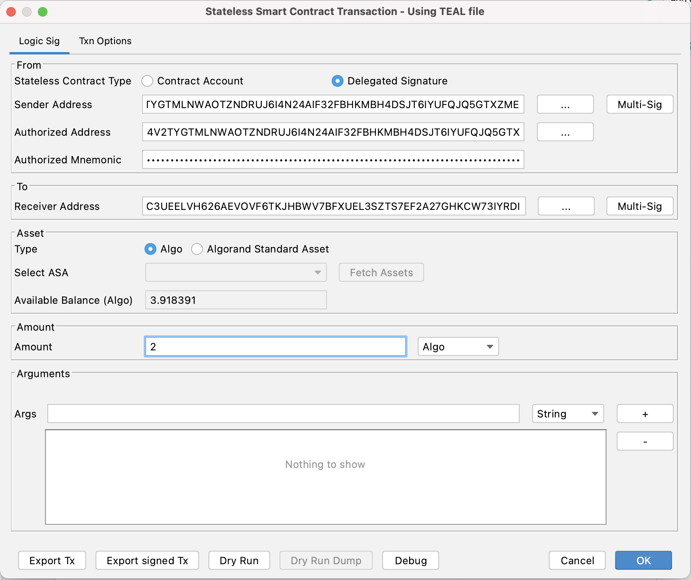

# Debug Stateless Contract

To debug a stateless contract :-

* Open stateless teal file in the editor
* Right click and select  "Algorand &gt;  Stateless Contract &gt; Send Transaction \(TEAL File\)"

* Enter transaction info and click "Debug"

* The IDE  starts tealdbg process and opens the Chrome browser \(If automatic browser opening option is not disabled\)

