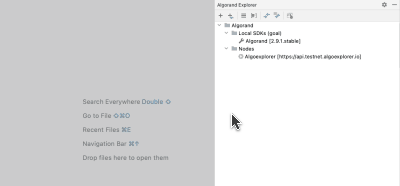
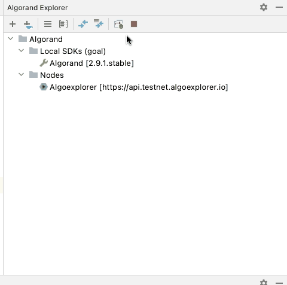

# Debugger Configuration

### Prerequisites

* Install Google Chrome Browser
* Install Algorand Node binary and configure "Local SDK"
* Select Local SDK as  "Compilation Target" 

### Configuration

The debugger configuration UI can be accessed from the Algorand tab in the right side panel of the IDE.

### Stop Debugger Process

When the debugger is running, you should see a "Stop" button in the toolbar in Algorand tab.

