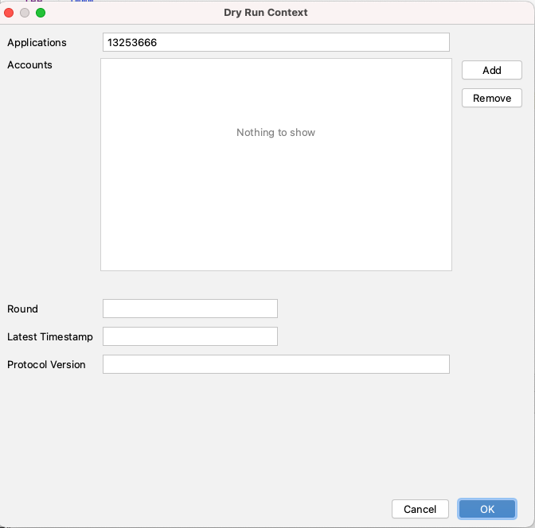

# Dry Run - Atomic Transfer

You can also use the "Dry Run" functionality for a group of transactions which are part of an Atomic Transfer.

Once you have created an Atomic Transfer by selecting individual transactions, grouping and signing in Atomic Transfer UI, you can provide additional Dry Run Context information for each transaction by   
Right click &gt; DryRun Source.

