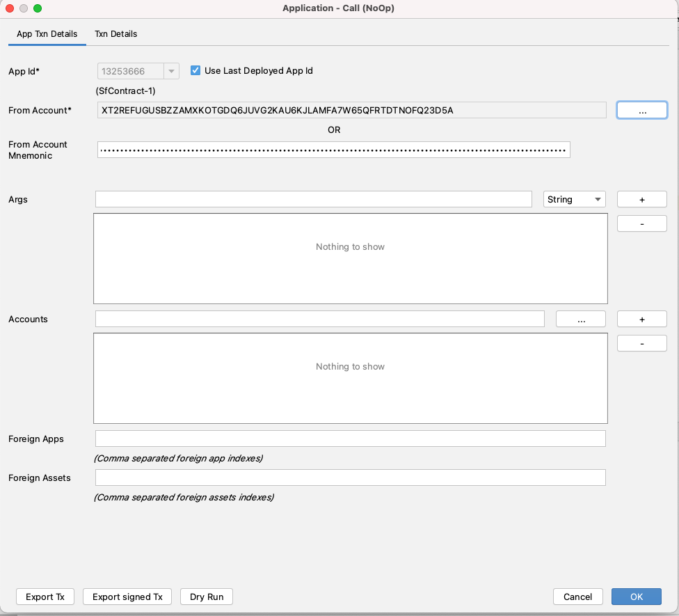
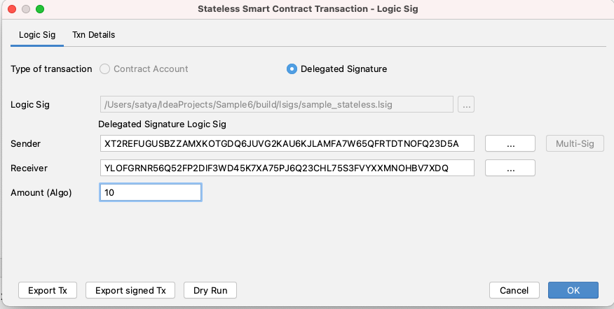
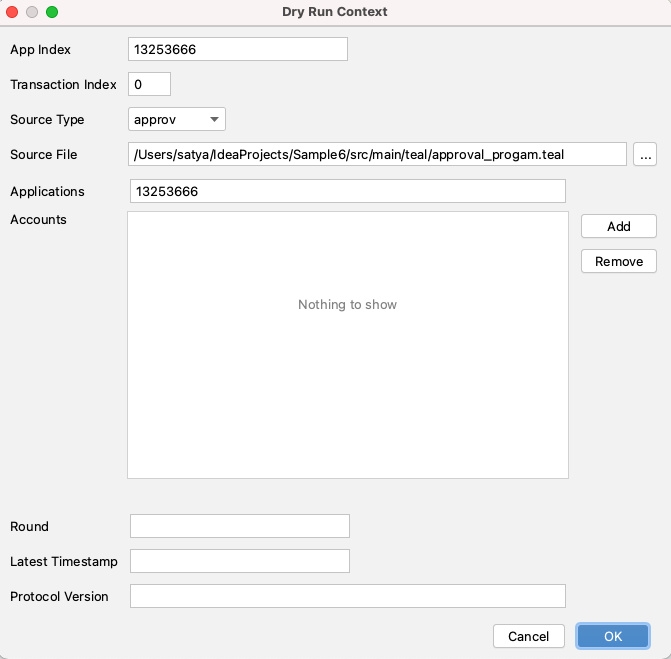
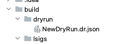
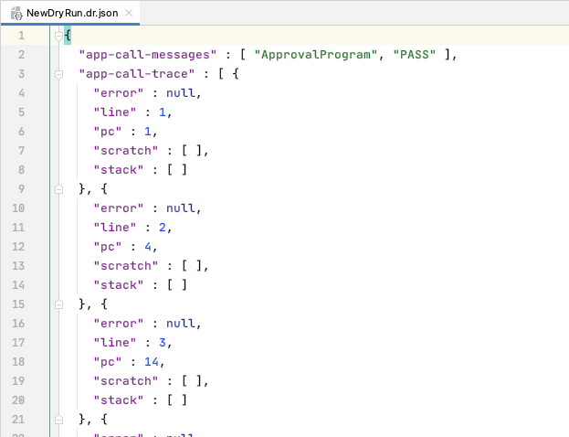

# Dry Run Stateful / Stateless Contract Call

Smart contracts can be debugged using two different methods. 

The first is an interactive debugger that uses the `tealdbg` command-line tool to launch a debug session where the smart contract can be examined as the contract is being evaluated. 

The second method is "Dry Run" which outputs a line by line result of the evaluation of the smart contract. 

With Dry Run support in algoDEA plugin, you can "Dry Run" any stateful or stateless smart contract transaction. You can also "Dry Run" an Atomic Transfer with multiple stateless and stateful smart contract transactions.

For stateful contract dry run, you also need to provide the path to the source file.

All contract transaction UIs \(stateful contract, stateless  contract/ logic sig, Atomic Transfer\) have a "Dry Run" button. 

 

#### Dry Run - Stateful Smart Contract Transaction 

While you try to dry run a stateful contract transaction, IDE opens an UI to capture additional inputs required for the dry run call. Some of the inputs like application Id, txn index are auto-populated. For a stateful contract call, you need to select the source teal file.

#### Dry Run Output file

Dry run output files are generated and stored under **build/dryrun** folder.

