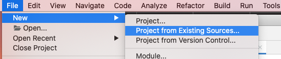
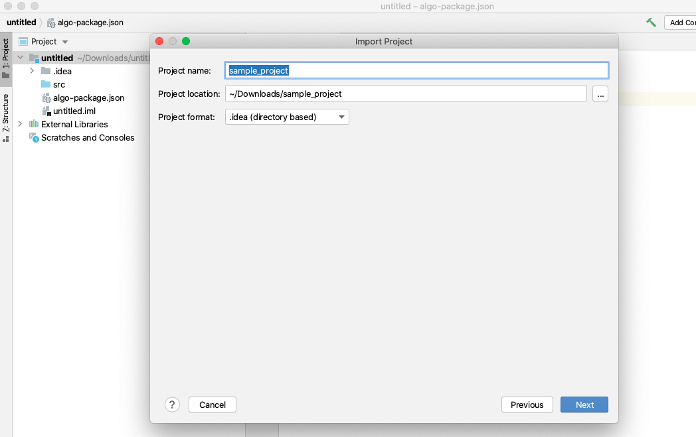
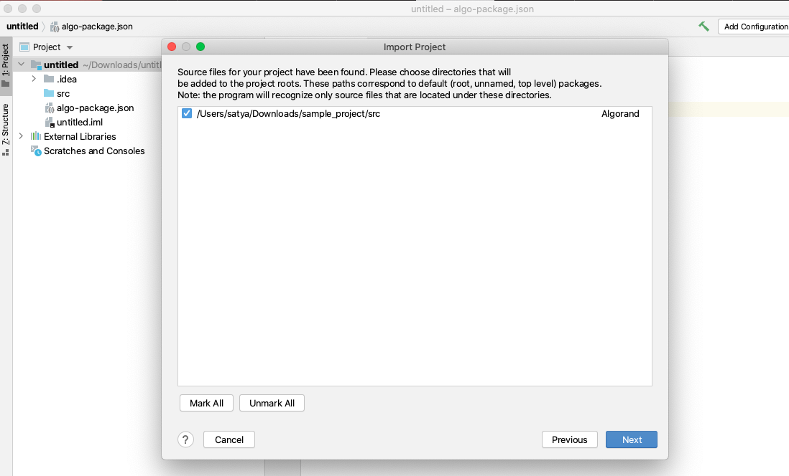
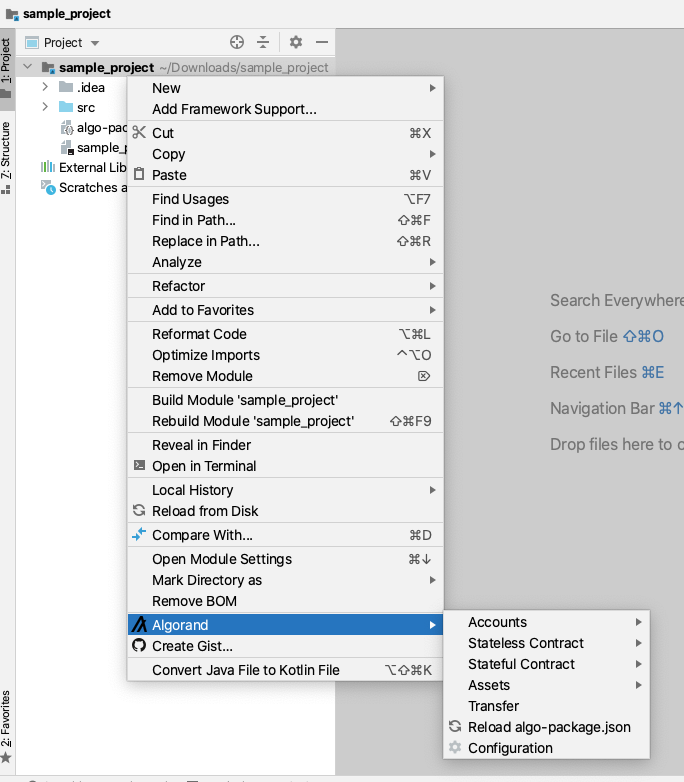

# Import an existing project

You can also create a project by importing existing source. 

The plugin checks if "algo-package.json" file is available at the project root or not and accordingly it enables or disables "Algorand" function.

1. Create a file "**algo-package.json**" in the project root folder with the following content.

```text
{
  "name": "<project_name>",
  "version": "<version>"
}
```

     **Note:** Replace &lt;project\_name&gt; and &lt;version&gt; with actual values. 

2. To import the source, click on File &gt; New &gt; Project From Existing Source.



3. Select the existing source root folder. Click next.







4. Now you should see, "Algorand" menu option in the project popup menu. If you don't see the menu item, wait for sometime or restart the IDE.





