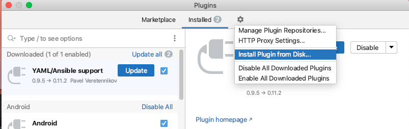
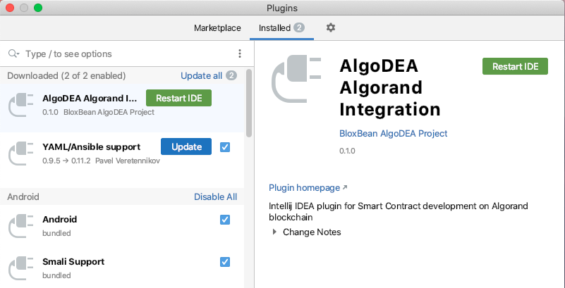

# Installation - Manual

## Download algoDEA plugin binary

Download the latest version of algoDEA plugin zip file from [ https://github.com/bloxbean/algodea/releases](https://github.com/bloxbean/algodea/releases)

### Installation

* Start IntelliJ IDEA \(2020.2 and above\)
* Select Configure &gt; Plugins

* Select "Install Plugin from Disk..."

* Click "Restart IDE" to restart and install the plugin

### Video

