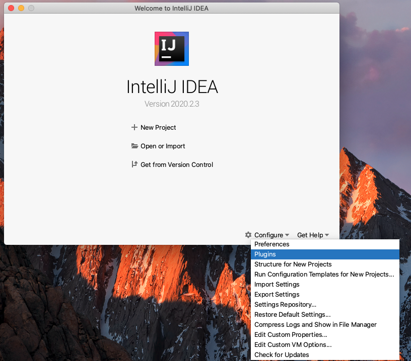
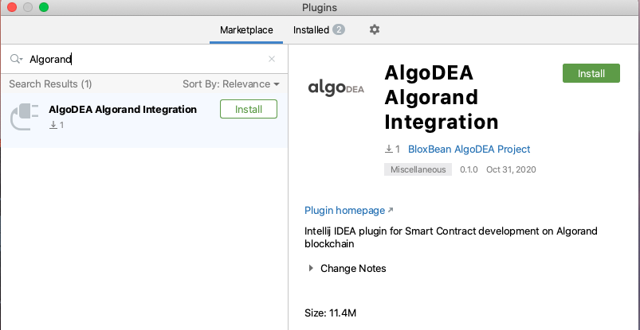
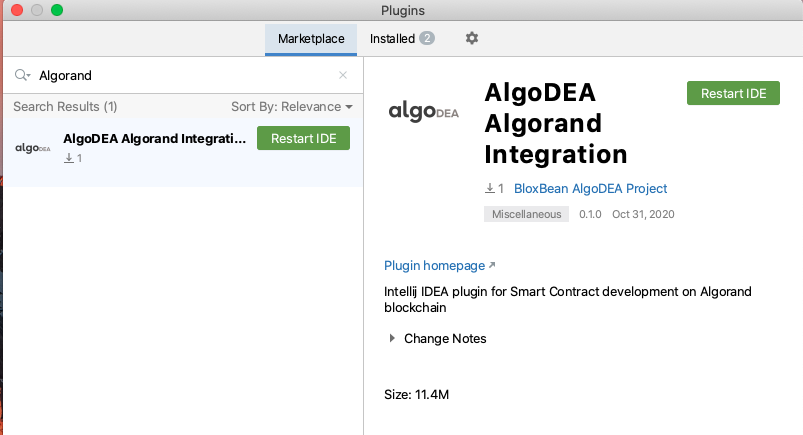

# Installation using JetBrains Plugin Repository

The algoDEA Algorand Integration plugin is available on JetBrain's official plugin repository. You can install this plugin directly from your IntelliJ IDE.

### Supported IntelliJ version  \(2020.2 and above\)

* IntelliJ IDEA Community
* IntelliJ IDEA Ultimate
* IntelliJ IDEA Educational

### Installation

1. Go to Configure &gt; Plugins

* Search marketplace with "Algorand" or "algodea".

* Click Install

* Restart 

### Video



