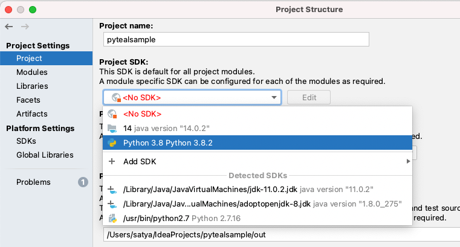

# Configure Python SDK and PyTeal

To use PyTeal in your smart contract project, you need to make sure the following steps are done.

### 1. Install Python plugin in IntelliJ IDE

If you don't have Python plugin installed yet, you can do that from "Plugins" page in IntelliJ IDE.

For **IntelliJ IDEA Community Edition**, you need to install "Python Community Edition" plugin.

For **IntelliJ IDEA Ultimate Edition**, check for "Python" plugin

### 2. Configure / Add Python SDK and Install PyTeal

Once the python plugin is installed, you can create a Python SDK inside IntelliJ IDE. But before that,  you need to make sure you already have Python installed on your machine.

#### To create / configure a new Python SDK 

* Right click on the  project and select "Open Module Settings"

* Select "SDKs" and Click "+" to add a new Python SDK

     

#### Install PyTeal

* Once the Python SDK is there, go to "packages" tab and click "+" to install pyteal.

### 3. Select Python SDK as Project's SDK

Go to "Project" and select Python SDK.

Now you are ready to write your first PyTeal program.

