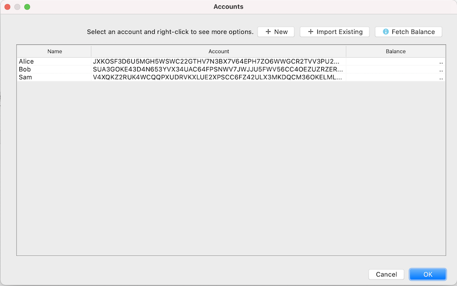

#Overview

Algorand is a public blockchain and protocol that aims to deliver decentralization, scale and security for all participants. It provides various unique features like ASA, Atomic Transfers, Stateless,
Stateless Smart Contract and many more.

AlgoDEA IntelliJ plugin provides end to end development life-cycle on Algorand blockchain using IntelliJ IDE.

Using this plugin, developers can create and test both stateless and stateful smart contracts directly from their IntelliJ IDE. Some of the other key features supported by this plugin are editor support for TEAL & PyTeal files, ASA management, Atomic Transfers, Test account management.

The goal of this plugin is to increase developer productivity by simplifying various interactions with Algorand blockchain. Due to simple consistent development workflow in the IDE, developers can iterate faster during development stage.

#Supported IntelliJ IDEs

This plugin currently works with the following IntelliJ IDEs with version 2020.2 and above.

- IntelliJ IDEA Community Edition
- IntelliJ IDEA Ultimate Edition
- IntelliJ IDEA Educational Edition

#Features

Below is the quick summary of the main features supported in this plugin.

##Account Management

Using this feature, developers can create & manage both standard and multi-signature accounts. These accounts are easily accessible from different Algorand specific functionalities in the IDE.

##Node Configuration

Developer can add or configure one or more Algorand Node inside the IDE. The supported node types are custom Algorand Node, Purestake.io node and Sandbox.

##TEAL Support 

The plugin supports various editor level features for TEAL files. 
Below are the few key features supported in the editor for TEAL file type.

- Context specific code completion
- Syntax Highlighter and Error Highlighting
- Op-Code usage help

##PyTeal Support

Not only TEAL file, developer can create PyTeal files and use them in stateless or stateful smart contract. 

With "PyTEAL Compile" option, a PyTEAL file can be easily compiled. All editor level supports are enabled by the default Python plugin in IntelliJ IDE.

##Stateless Contract

Developer can easily create, test stateless smart contract directly inside their IDE. The plugin comes with many out-of-box stateless smart contract
templates. 

###Stateful Contract

The plugin supports full lifecycle of stateful smart contract. All types of stateful smart contract transactions are supported through a dedicated user interface. 

##Payment Transaction

Using this feature, developer can easily transfer Algo or any ASA from one account address to another. It simplifies the complexity of creating, submitting and monitoring a payment transaction through a simplified user
interface. 

##Atomic Transfer 

The creation of Atomic Transfer transaction is a multi-step process. With an intuitive user interface, the plugin simplifies the process for creation & submission of Atomic Transfer transaction.

##Asset Management

The plugin supports full lifecycle of the Algorand Standard Asset inside IntelliJ IDE. A new ASA can be easily created, managed through "Asset Management" UI. The standard "Transfer" UI supports both Algo and Algorand Standard Assets.

##Export Transaction

Using "Export Transaction" and "Export Signed Transaction", developer can serialize a transaction to a JSON file which can be used for different purpose later. These options are available through every transaction submission UIs in IntelliJ IDE.

##Dry run

Using Dry Run support, developer can easily debug a stateful contract call or stateless contract result. This feature is also available for contract calls in Atomic Transfer.

#Getting Started Video

To see AlgoDEA plugin in action, check out this getting started video.

<iframe width="560" height="315" src="https://www.youtube.com/watch?v=sah1z0BinW0" frameborder="0" allow="accelerometer; autoplay; encrypted-media; gyroscope; picture-in-picture" allowfullscreen></iframe> 

#Resources

Detailed step-by-step guides and videos can be found at [AlgoDEA Docs site](https://algodea-docs.bloxbean.com/)

The plugin source code can be found at [AlgoDEA GitHub](https://github.com/bloxbean/algodea)

 
 

